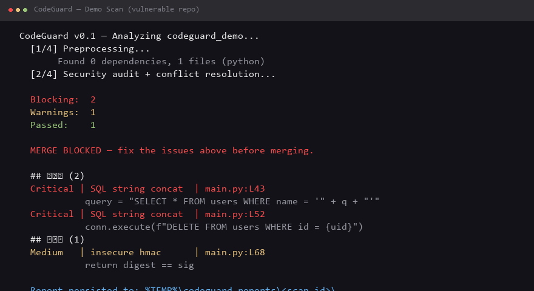
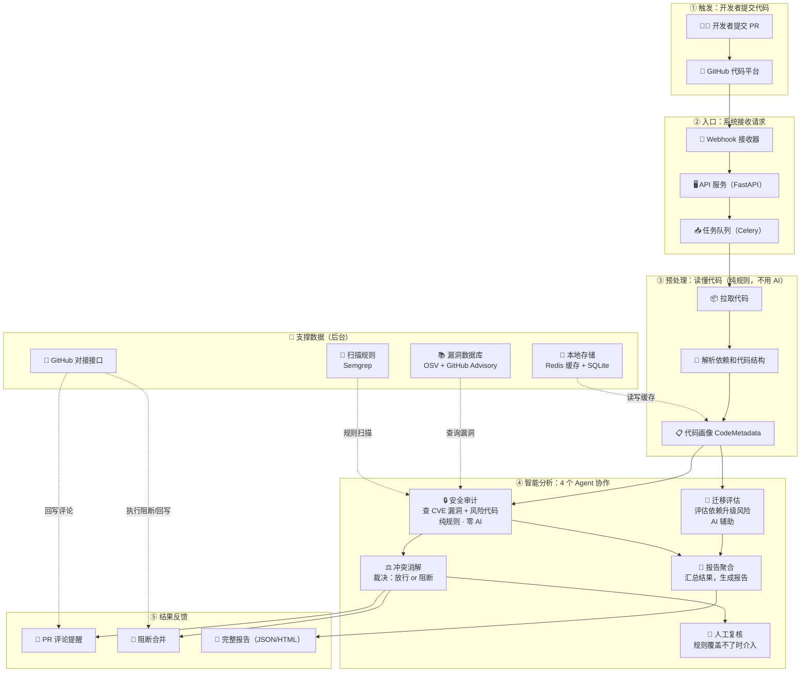

# CodeGuard

**多 Agent 代码库安全分析平台（Multi-Agent Code Repository Security Analysis Platform）**

[](https://www.python.org/)
[](https://github.com/yyyyyyyysf/codeguard-multi-agent-security/actions/workflows/ci.yml)
[](https://langchain-ai.github.io/langgraph/)
[](LICENSE)
[](https://github.com/yyyyyyyysf/codeguard-multi-agent-security)

**把安全分析嵌入 CI/CD：PR 提交时自动扫描漏洞与升级风险，高危直接阻断合并——不是事后报告，是风险发生点拦截。**

多 Agent 编排（LangGraph）· 安全链路**零 LLM**（证据链可溯源）· 人在回路兜底 · 268 个测试全绿

## 目录

- [效果演示](#效果演示)
- [系统架构](#系统架构)
- [快速开始](#快速开始)
- [CLI 参数](#cli-参数)
- [功能特性](#功能特性)
- [API 接口](#api-接口)
- [项目数据](#项目数据)
- [技术栈](#技术栈)

## 效果演示

对含 5 个真实漏洞的演示仓库（SQL 注入 / 硬编码密钥 / 非恒定时间 HMAC 比较）扫描，约 10 秒：

```
Blocking:  2 / Warnings: 1 / Passed: 1
MERGE BLOCKED — fix the issues above before merging.
```



- 命中 2 条 SQL 注入（Critical，`main.py:L43`，自动阻断）+ 1 条 HMAC 风险（转人工复核）
- 完整报告自动落盘 `report.json`：每条命中含规则 ID / 文件行号 / **真实代码片段**（证据链可溯源）
- 自举验证：用 CodeGuard 扫自身，156 文件 **13 项规则零误报**（存档 `docs/verification/self-scan-2026-08-25.json`）
- 一分钟走读：`docs/verification/demo-guide.md`

## 系统架构

```
GitHub Webhook -> FastAPI -> Celery -> 预处理 -> 4 个 AI Agent -> GitHub Check Runs
                                                          |
                              ┌───────────────────────────┼───────────────────────────┐
                              ▼                           ▼                           ▼
                       安全审计                    冲突消解                  迁移评估
                       (CVE + Semgrep)           (自动裁决 +                (破坏性变更
                       零 LLM                      人在回路)                   + LLM 辅助)
                              │                           │                           │
                              └───────────────────────────┼───────────────────────────┘
                                                          ▼
                                                    报告聚合
                                                    (PR 评论 + HTML)
```

**全景图**（Mermaid，GitHub 自动渲染）:



> 面向非技术读者的通俗图解：[`docs/architecture-overview.md`](docs/architecture-overview.md)

## 快速开始

```bash
# 克隆并初始化
git clone https://github.com/yyyyyyyysf/codeguard-multi-agent-security.git
cd codeguard
cp .env.example .env
# 必填：编辑 .env，设置 CODEGUARD_API_KEY 和 GITHUB_WEBHOOK_SECRET
# （未配置前 API 与 Webhook 端点会拒绝请求）

# Docker 方式
docker-compose up -d

# 或 CLI 方式（无需服务器、无需任何 API key）
python -m src.cli.main analyze ./my-project
python -m src.cli.main analyze ./my-project --target fastapi:0.100.0:0.110.0
```

### CLI 参数

| 参数 | 说明 |
|--------|-------------|
| `<repo>` | 必填。本地 git 仓库路径（须含 `.git`） |
| `--no-migration` | 跳过 AI 迁移评估（快，无需 LLM key） |
| `--target <框架:旧版本:新版本>` | 启用迁移评估，如 `fastapi:0.100.0:0.110.0` |
| `--json` | 终端输出原始 JSON（默认输出 Markdown 摘要） |
| `--output <路径>` | 将完整报告另存为 JSON 文件 |
| `--scan-type full\|diff` | 全量扫描 / 仅差异扫描（默认 `full`） |
| `--branch <分支名>` | 指定扫描分支（默认 `main`） |
| `--block-severity high\|critical` | 阻断阈值（默认 `high`） |

报告自动落盘到 `$REPORT_STORAGE_DIR/<scan_id>/report.json`（+ `pr_comment.md`）。完整走读见 `docs/verification/demo-guide.md`。

## 功能特性

> **为什么安全链路零 LLM？** 可追溯性——每条安全结论绑定 CVE 编号 / Semgrep 规则 ID + 权威来源，黑盒模型做不到（详见 `docs/adr/ADR-001`）。LLM 仅用于迁移评估的代码影响分析（辅助参考，不参与裁决）。

| 功能 | 说明 |
|---------|-------------|
| CVE 漏洞扫描 | 三级缓存（Redis → SQLite → OSV API），区分直接/传递依赖 |
| 代码风险扫描 | Semgrep 自定义规则（`config/semgrep/`）：硬编码密钥、SQL 注入、不安全反序列化 |
| 自动阻断 | 存在 `blocking=true` 的高危项时阻断 PR 合并 |
| 人在回路 | 边界情况可申请豁免复核；裁决超时（24h）默认维持阻断，绝不默认放行 |
| 迁移评估 | AST 静态规则 + LLM 辅助的破坏性变更检测 |
| 零 LLM 安全链 | 安全结论全部来自确定性规则 + 权威漏洞库 |

## API 接口

| 方法 | 路径 | 说明 |
|--------|------|-------------|
| POST | `/api/v1/analyze` | 提交分析任务 |
| GET | `/api/v1/tasks/{id}` | 查询任务状态 |
| GET | `/api/v1/tasks/{id}/report` | 获取完整报告 |
| POST | `/api/v1/tasks/{id}/appeal` | 提交豁免复核 |
| GET | `/health` | 健康检查 |
| POST | `/webhook/github` | GitHub Webhook 接收器 |

## 项目数据

```
模块数:      14 个完成
测试:        268 passed（全绿）
Agent 覆盖率: 87%（语句覆盖，2026-08-25 复验）
代码量:      ~10,700 行 Python（wc -l，含注释）
核心扫描:    ~40 ms（3 依赖 + 2 文件，本地 Semgrep 规则）
提交数:      42
```

## 技术栈

| 分层 | 技术 |
|-------|-----------|
| API 层 | FastAPI + Pydantic v2 |
| 异步任务 | Celery + Redis |
| Agent 编排 | LangGraph（StateGraph + Checkpoint） |
| 漏洞数据 | OSV API + GitHub Advisory Database |
| 代码分析 | Tree-sitter + Semgrep |
| LLM（仅辅助） | DeepSeek-Coder |
| 存储 | SQLite（MVP）+ Redis |
| 部署 | Docker Compose |

---

> 技术选型与设计决策：`docs/adr/`（零 LLM 安全链 / 混合编排 / 四 Agent 划分）· 架构图解：`docs/architecture-overview.md`（面向非技术读者）· 演示指南：`docs/verification/demo-guide.md`
