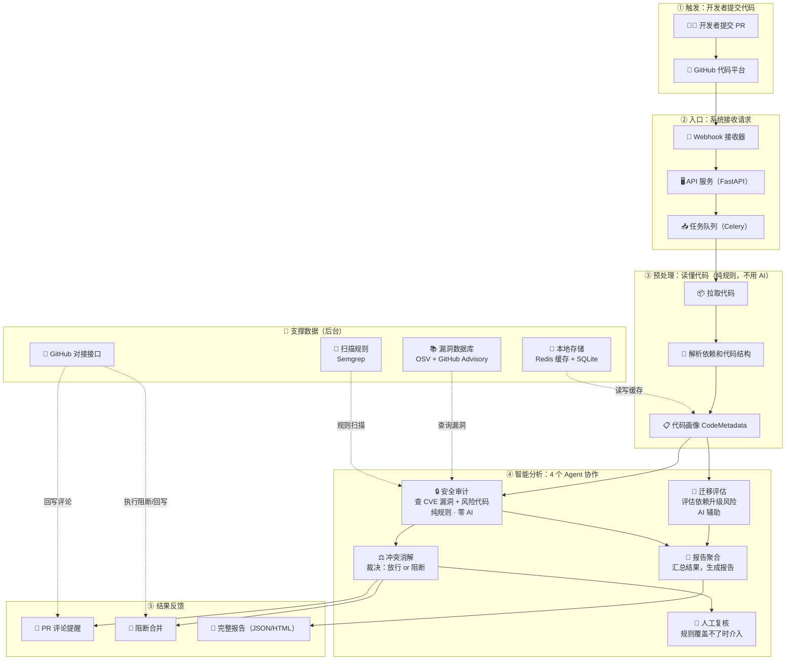

# CodeGuard

**Multi-Agent Code Repository Security Analysis Platform**

[](https://www.python.org/)
[](https://fastapi.tiangolo.com/)
[](https://langchain-ai.github.io/langgraph/)
[]()
[](https://github.com/yyyyyyyysf/codeguard-multi-agent-security)

CodeGuard embeds automated security analysis into your CI/CD pipeline — blocking vulnerabilities at the PR level before they reach production.

## Architecture

```
GitHub Webhook -> FastAPI -> Celery -> Preprocess -> 4 AI Agents -> GitHub Check Runs
                                                          |
                              ┌───────────────────────────┼───────────────────────────┐
                              ▼                           ▼                           ▼
                       Security Audit             Conflict Resolution          Migration Assessment
                       (CVE + Semgrep)            (Auto-resolver +             (Breaking Changes
                       Zero LLM                    Human-in-the-loop)           + LLM-assisted)
                              │                           │                           │
                              └───────────────────────────┼───────────────────────────┘
                                                          ▼
                                                   Report Aggregation
                                                   (PR Comment + HTML)
```

**Full picture at a glance** (Mermaid, renders on GitHub):



> A plain-language walkthrough of this diagram lives in [`docs/architecture-overview.md`](docs/architecture-overview.md).

## Quick Start

```bash
# Clone and setup
git clone https://github.com/yyyyyyyysf/codeguard-multi-agent-security.git
cd codeguard
cp .env.example .env
# REQUIRED: edit .env and set CODEGUARD_API_KEY, GITHUB_WEBHOOK_SECRET
# The API and webhook endpoints will reject requests until these are configured.

# Run with Docker
docker-compose up -d

# Or CLI mode (no server needed, no API key required)
python -m src.cli.main analyze ./my-project
python -m src.cli.main analyze ./my-project --target fastapi:0.100.0:0.110.0
```

### CLI options

| Option | Description |
|--------|-------------|
| `<repo>` | Required. Path to a local git repository (must contain `.git`) |
| `--no-migration` | Skip AI migration assessment (fast, no LLM key needed) |
| `--target <framework:from:to>` | Enable migration assessment, e.g. `fastapi:0.100.0:0.110.0` |
| `--json` | Print raw JSON instead of Markdown summary |
| `--output <path>` | Also save the full report as JSON to a file |
| `--scan-type full\|diff` | Full scan or diff-only (default: `full`) |
| `--branch <name>` | Branch to scan (default: `main`) |
| `--block-severity high\|critical` | Blocking threshold (default: `high`) |

Reports are persisted automatically to `$REPORT_STORAGE_DIR/<scan_id>/report.json` (+ `pr_comment.md`). See `docs/verification/demo-guide.md` for a full walkthrough.

## Features

| Feature | Description |
|---------|-------------|
| CVE Scanning | 3-tier cache (Redis -> SQLite -> OSV API), direct/transitive classification |
| Code Security | Semgrep (auto rule set, `config/semgrep/` reserved for custom rules): hardcoded secrets, SQL injection, unsafe deserialization |
| Auto-blocking | PR merge blocked until all `blocking=true` findings are resolved |
| Human-in-the-loop | Exemption appeals for edge cases, with audit trail |
| Migration Assessment | Breaking Changes detection (AST rules + LLM-assisted) |
| Zero-LLM Security | Security conclusions from deterministic rules + authoritative databases only |

## API

| Method | Path | Description |
|--------|------|-------------|
| POST | `/api/v1/analyze` | Submit analysis task |
| GET | `/api/v1/tasks/{id}` | Query task status |
| GET | `/api/v1/tasks/{id}/report` | Get full report |
| POST | `/api/v1/tasks/{id}/appeal` | Submit exemption appeal |
| GET | `/health` | Health check |
| POST | `/webhook/github` | GitHub webhook receiver |

## Project Stats

```
Modules:     14 completed
Tests:       268 passed
Agent coverage: 87% avg (statement coverage, 2026-08-25 re-verified)
Lines:       ~10,700 Python (wc -l, incl. comments)
Commits:     30
```

## Tech Stack

| Layer | Technology |
|-------|-----------|
| API | FastAPI + Pydantic v2 |
| Async Tasks | Celery + Redis |
| Agent Orchestration | LangGraph (StateGraph + Checkpoint) |
| CVE Data | OSV API + GitHub Advisory Database |
| Code Analysis | Tree-sitter + Semgrep |
| LLM (auxiliary only) | DeepSeek-Coder |
| Storage | SQLite (MVP) + Redis |
| Deployment | Docker Compose |

## Development

```bash
# Install dev dependencies
pip install -e ".[dev]"

# Run all tests
python -m pytest tests/ -v

# Run specific agent tests
python -m pytest tests/unit/test_agents/test_security/ -v
```
