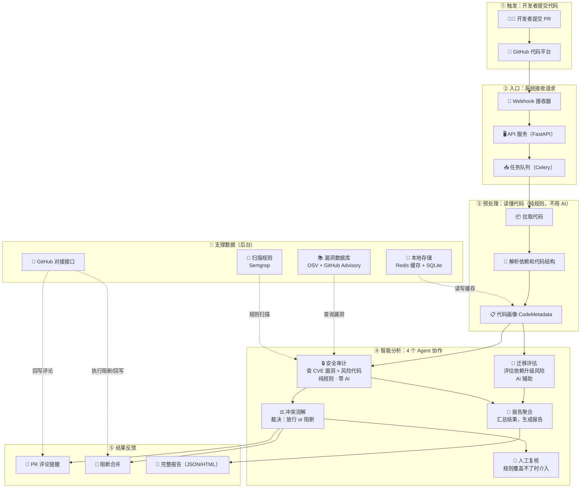

# CodeGuard 架构图解（面向非技术读者）

> **版本**: v0.1
> **日期**: 2026-08-24
> **说明**: 本文档用一张图 + 通俗解释，说明 CodeGuard 是什么、代码提交后系统内部做了什么、各模块之间是什么关系。不涉及任何代码细节，给产品、测试、新同学、评审人看都合适。
> **关联**: 完整系统设计见 `docs/specs/codeguard-v0.1-design-spec.md`；技术架构总览见根目录 `ARCHITECTURE.md`。

---

## 一句话看懂 CodeGuard

CodeGuard 是一个**嵌在研发流水线里的自动"安检员"**：开发者每次提交代码（PR）时，它自动把代码检查一遍——查漏洞、查风险、评估依赖升级的影响——然后在 GitHub 上直接给出结论：**放行，还是阻断合并**。全程自动，不需要人盯。

---

## 整体架构图

> 下图使用 Mermaid 语法绘制，在 GitHub、Typora、VS Code、mermaid.live 等支持 Mermaid 的工具中均可直接渲染。

---

## 逐层解释

整个系统是一条**流水线**，代码提交后自动走完五步：

### ① 触发：开发者提交代码

开发者把改好的代码提交为 PR（Pull Request，合并请求）。这一步发生在 GitHub 上，CodeGuard 本身不参与，只是"收到通知"。

### ② 入口：系统接收请求

| 模块 | 通俗解释 |
|------|----------|
| Webhook 接收器 | GitHub 的"来电提醒"：一有新 PR 就通知 CodeGuard |
| API 服务（FastAPI） | 系统的对外窗口，处理各类请求，校验身份 |
| 任务队列（Celery） | 排队机制：请求多了不堵车，一个个按顺序处理 |

### ③ 预处理：读懂代码

这一步**不用 AI**，纯靠确定性程序完成三件事：把代码下载下来 → 拆解出依赖清单和代码结构 → 生成一份标准化的"代码画像"（CodeMetadata），交给后面的分析环节使用。

### ④ 智能分析：4 个 Agent 分工协作

这是系统的核心。4 个"机器人"各管一段，互不干扰：

| Agent | 干什么 | 用不用 AI |
|-------|--------|-----------|
| 🔒 安全审计 | 查依赖有没有已知漏洞（CVE）、代码里有没有硬编码密钥/SQL 注入等风险 | **零 AI**，纯规则引擎 + 权威漏洞库，结论可追溯 |
| ⚖️ 冲突消解 | 根据安全审计结果做最终裁决：放行 or 阻断 | **零 AI**，确定性规则裁决；规则覆盖不了时转人工 |
| 🔄 迁移评估 | 评估升级依赖（框架/版本）带来的"破坏性变更"风险和工作量 | AI 辅助分析 |
| 📝 报告聚合 | 把各方结果去重、汇总、渲染成报告 | 仅模板渲染，不做判断 |

**👤 人工复核**：仅在自动裁决规则无法覆盖的边缘情况触发。人工裁决超时（默认 24 小时）自动维持"阻断"，绝不默认放行（fail-safe 原则）。

### ⑤ 结果反馈

- 安全 → 在 PR 下回写评论提醒，可正常合并
- 有风险 → **直接阻断合并**，修完才能过（这是 CodeGuard 与"事后报告"类工具的本质区别）
- 全量结果 → 生成完整报告（JSON / HTML）存档

### 🧰 支撑数据（后台）

| 数据源 | 作用 |
|--------|------|
| 漏洞数据库（OSV + GitHub Advisory） | 权威漏洞来源，供安全审计查询 |
| 扫描规则（Semgrep） | 代码风险扫描规则库 |
| 本地存储（Redis + SQLite） | 缓存加速 + 持久化存储 |
| GitHub 对接接口 | 负责执行"阻断/回写评论"等对外操作 |

---

## 三个关键设计（为什么这么设计）

1. **安全链路零 AI**：安全结论全部来自确定性规则 + 权威漏洞库，不靠大模型"猜"，保证证据链 100% 可追溯、零幻觉。
2. **阻断前置**：冲突消解做出裁决后**立即**执行阻断/放行，不等报告生成完，保障 SLA（安全链路端到端 ≤ 3 秒）。
3. **双链路并行**：迁移评估与安全审计并行跑，迁移结果**永不参与**安全裁决，互不干扰。

---

## 图中模块 ↔ 代码目录对照

| 图中模块 | 代码目录 |
|----------|----------|
| API 服务 | `src/api/` |
| Webhook 接收器 | `src/webhook/` |
| 任务队列 | `src/tasks/` |
| 预处理（拉取/解析/画像） | `src/preprocess/` |
| 安全审计 | `src/agents/security/` |
| 冲突消解（含人工复核） | `src/agents/conflict/` |
| 迁移评估 | `src/agents/migration/` |
| 报告聚合 | `src/agents/reporter/` |
| 漏洞库 / 扫描规则 / 存储 | `src/storage/`、`config/` |
| GitHub 对接 | `src/integrations/` |
| 公共支撑（异常/工具/日志等） | `src/core/`、`src/utils/` |
| 编排引擎 | `src/engine/` |

---

> **最后更新**: 2026-08-24
